# 🚀 FocusTrak

> A modern, fast, and distraction-free cross-platform productivity app built with **Tauri v2**, **React**, **TypeScript**, **Rust**, and **SQLite**.

FocusTrak is designed for students, developers, professionals, and anyone who wants a lightweight, privacy-focused productivity application. Manage your tasks, build habits, stay focused, and organize your work — all while keeping your data stored locally on your device.

---

## ✨ Features

- ✅ Smart Task Management
- 📅 Interactive Calendar
- ➕ Quick Task Creation
- 🎯 Focus Mode (Pomodoro Timer)
- 🔥 Habit Tracker
- 📝 Notes & Documents
- 📊 Productivity Statistics
- ⚙️ Personalized Settings
- 💾 Local SQLite Database
- 📱 Linux & Android Support
- ⚡ Native Performance powered by Tauri
- 🔒 Offline-first (Your data never leaves your device)

---

# 🖥️ Screenshots

## 🏠 Dashboard

| Desktop | Android |
|----------|----------|
| 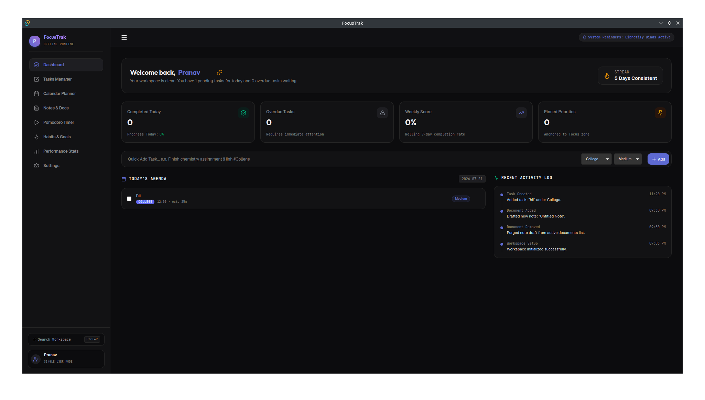 | 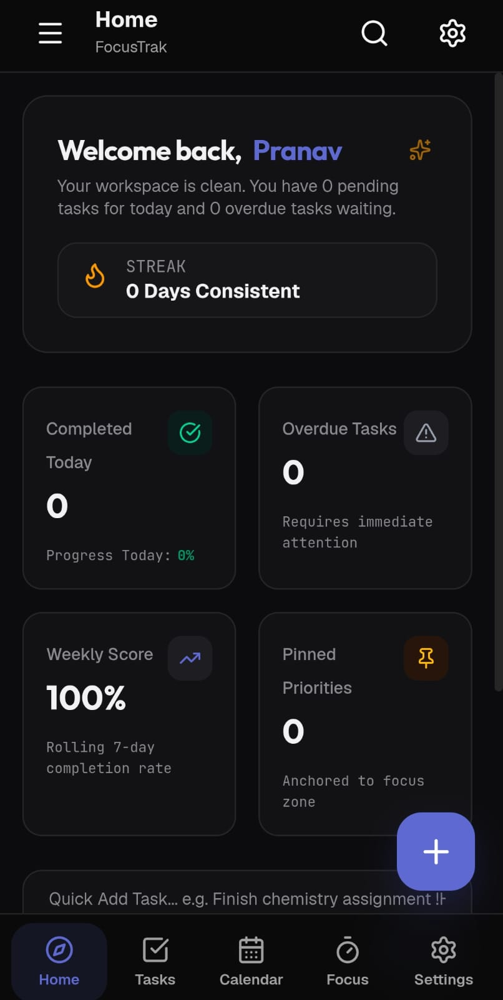 |

---

## 📝 Task Management

| Desktop | Android |
|----------|----------|
| 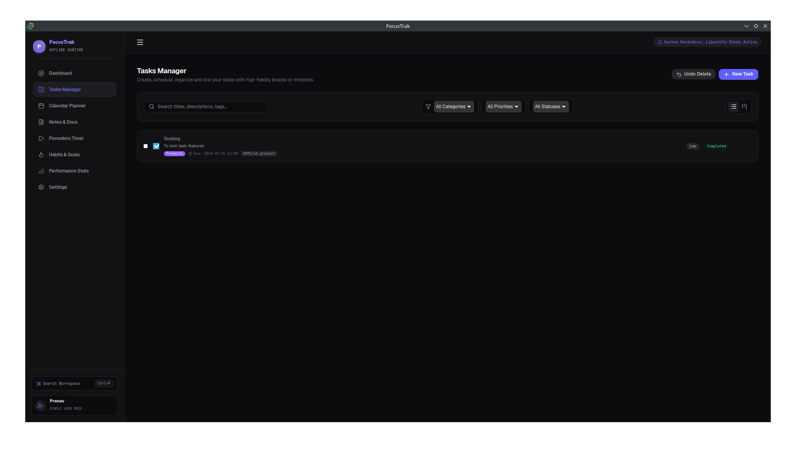 | 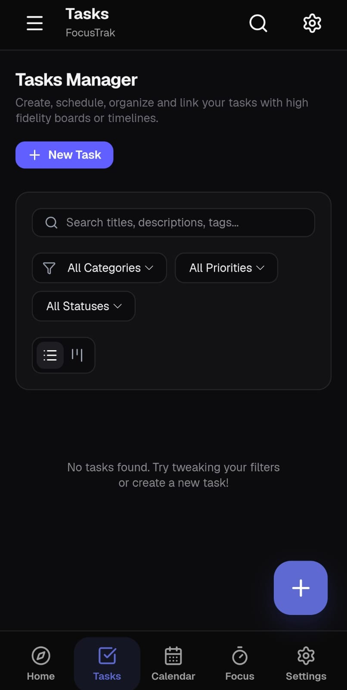 |

---

## ➕ Create Task

| Desktop | Android |
|----------|----------|
| 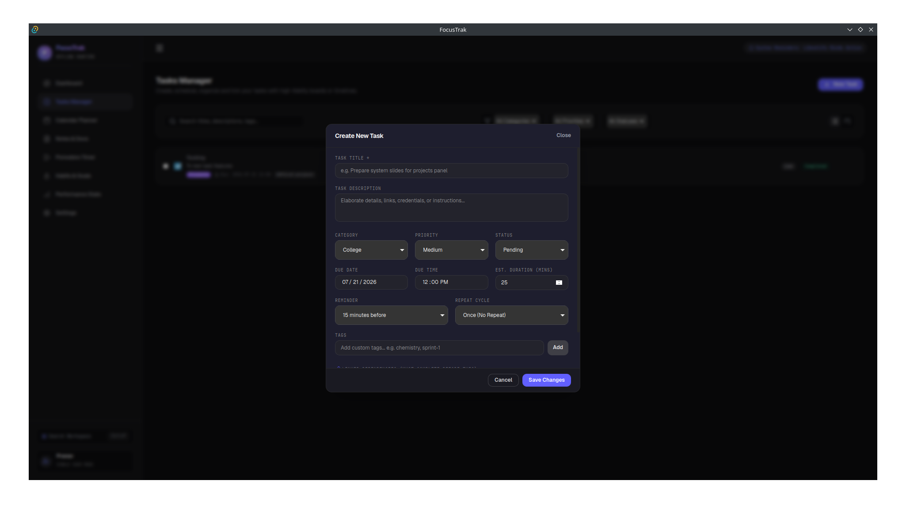 | 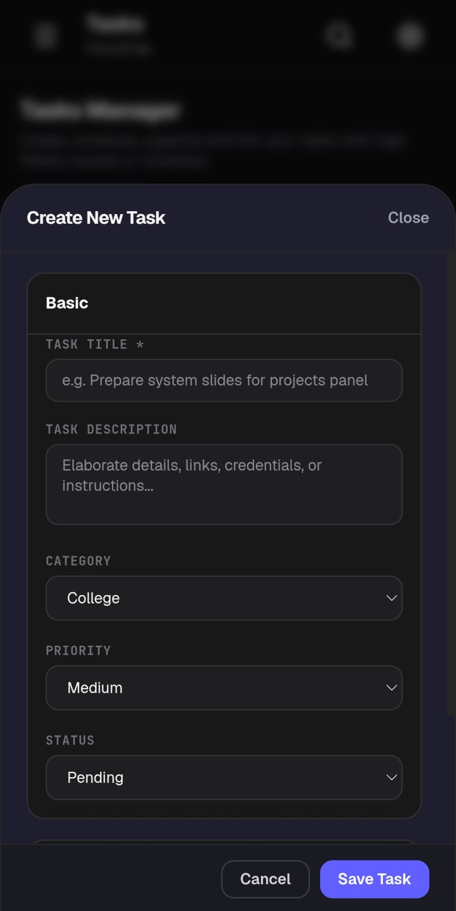 |

---

## 📅 Calendar

| Desktop | Android |
|----------|----------|
| 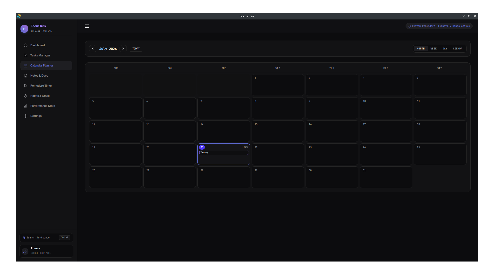 | 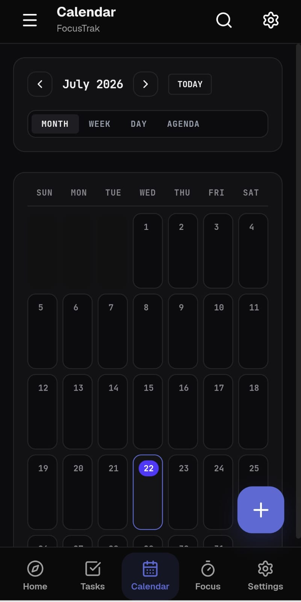 |

---

## 🎯 Focus Mode

| Desktop | Android |
|----------|----------|
| 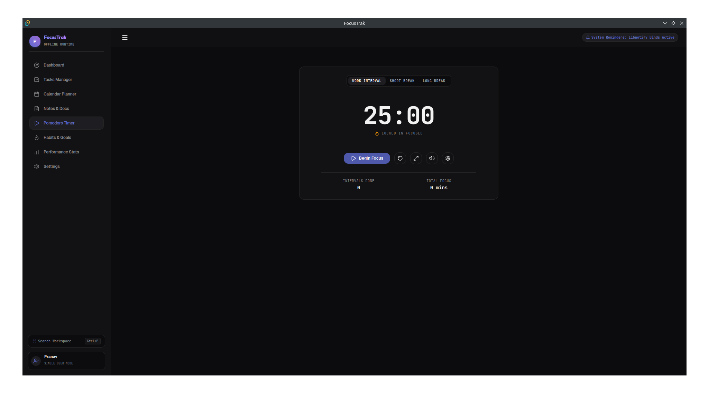 |  |

---

## 🔥 Habit Tracker

| Desktop | Android |
|----------|----------|
| 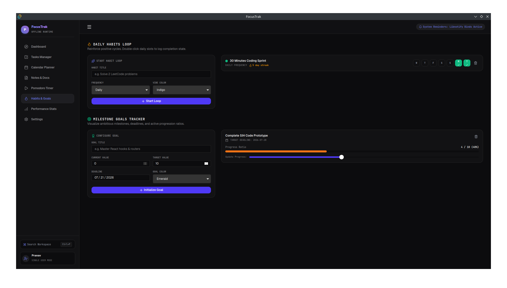 | 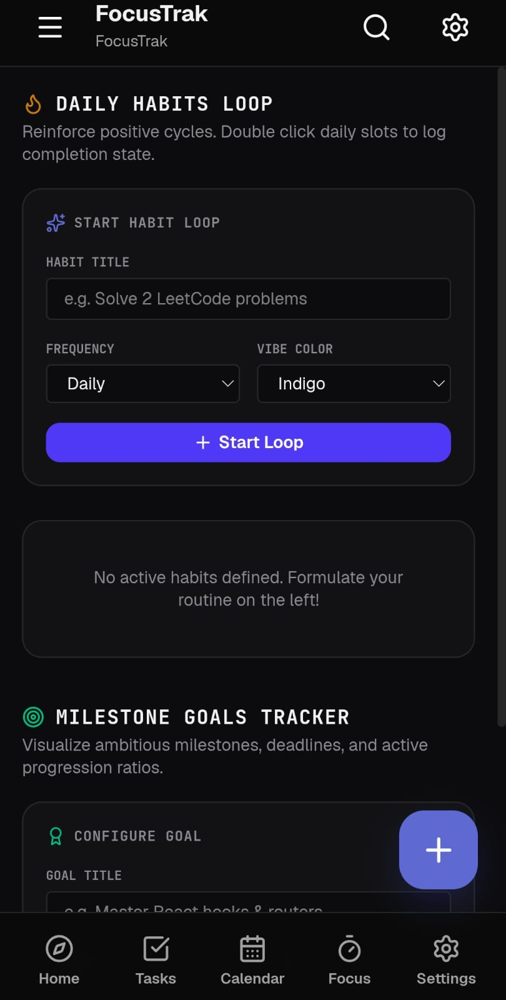 |

---

## 📝 Notes & Documents

| Desktop | Android |
|----------|----------|
| 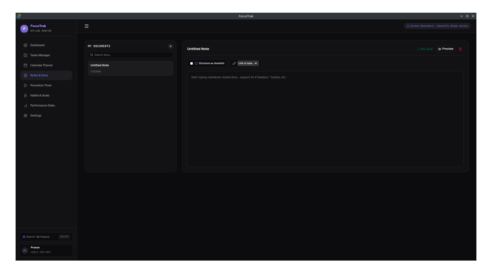 | 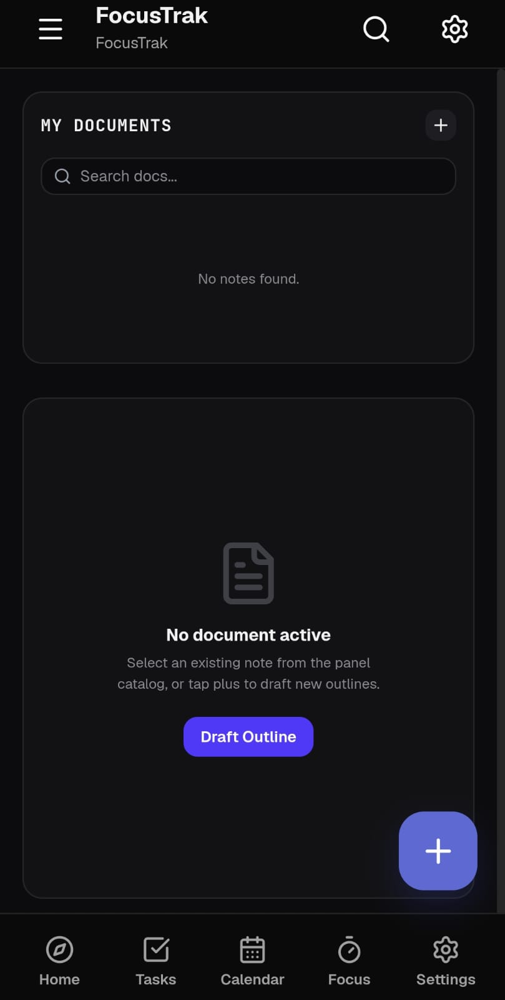 |

---

## ⚙️ Settings & Statistics

| Desktop | Android |
|----------|----------|
| 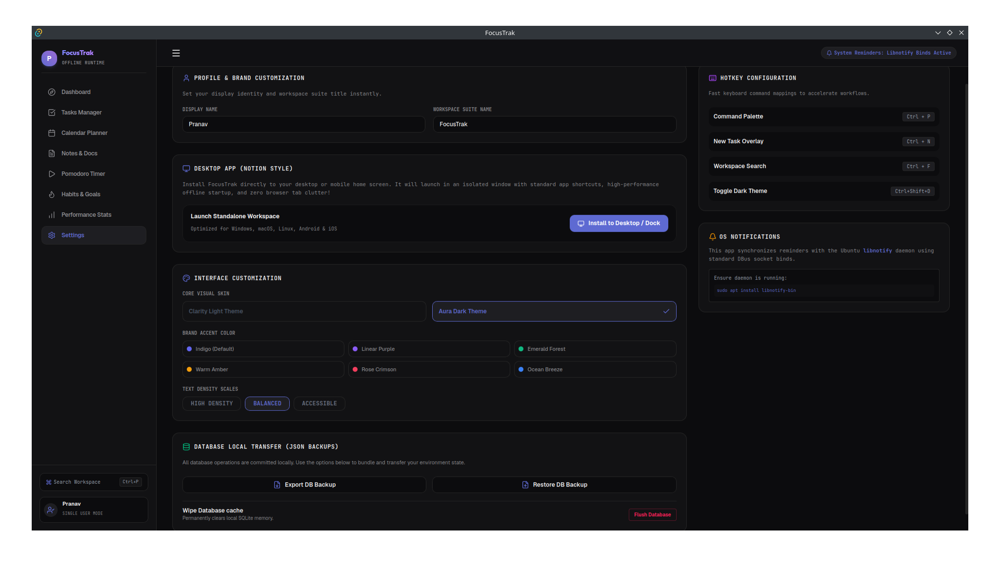<br><br>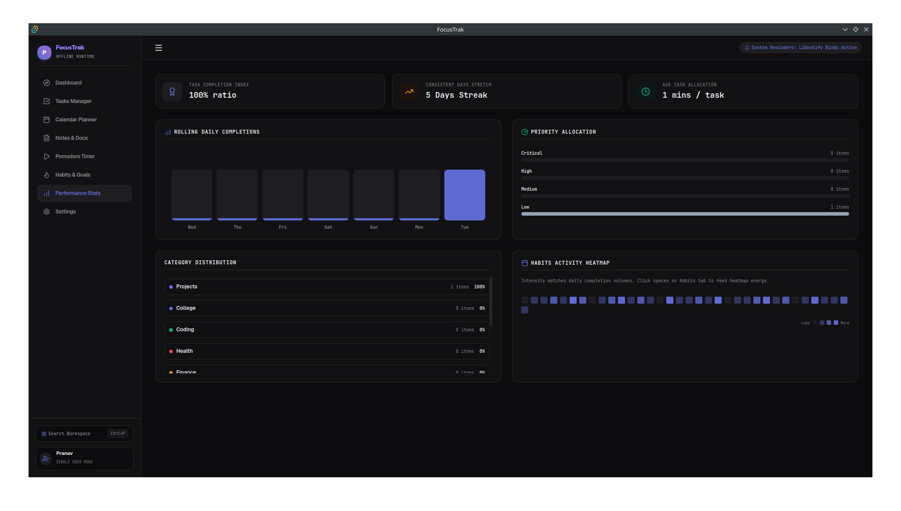 | 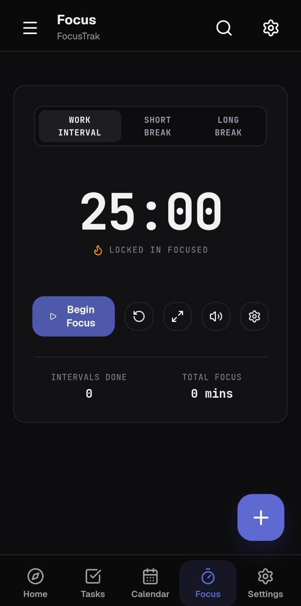 |

---

## 🛠️ Tech Stack

| Technology | Purpose |
|------------|---------|
| Tauri v2 | Cross-platform Desktop & Android Framework |
| React | Frontend |
| TypeScript | Type Safety |
| Rust | Backend |
| SQLite | Local Database |
| Vite | Build Tool |
| Tailwind CSS | UI Styling |

---

## 📂 Project Structure

```text
FocusTrak/
│
├── src/                     # React Frontend
├── src-tauri/               # Rust Backend
├── screenshots/
│   ├── Desktop/
│   └── Mobile/
├── public/
├── package.json
└── README.md
```

---

## 🚀 Getting Started

### Clone the Repository

```bash
git clone https://github.com/codex-pranav/FocusTrak.git
cd FocusTrak
```

---

### Install Dependencies

```bash
npm install
```

---

### Run in Development

```bash
npm run tauri dev
```

---

### Build Production App

#### Linux

```bash
npm run tauri build
```

#### Android

```bash
npm run tauri android build
```

---

## 📦 Installation

### Linux (.deb)

```bash
sudo apt install ./src-tauri/target/release/bundle/deb/*.deb
```

### Android

Download the latest **FocusTrak.apk** from the **Releases** section and install it on your Android device.

---

## 📌 Roadmap

- [x] Task Management
- [x] Calendar
- [x] Focus Mode
- [x] Habit Tracker
- [x] Notes & Documents
- [x] Productivity Statistics
- [x] Local SQLite Database
- [x] Linux Support
- [x] Android Support
- [ ] Notifications
- [ ] Recurring Tasks
- [ ] Cloud Sync
- [ ] Backup & Restore
- [ ] Themes
- [ ] Windows Support
- [ ] macOS Support

---

## 🤝 Contributing

Contributions, issues, and feature requests are always welcome.

Feel free to fork this repository and submit a Pull Request.

---

## 📄 License

This project is licensed under the **MIT License**.

---

## ⭐ Support

If you found this project useful, consider giving it a **⭐ Star** on GitHub.

It helps the project grow and motivates future development.

---

## 👨‍💻 Author

**Pranav Raj**

GitHub: https://github.com/codex-pranav

---

### Made with ❤️ using Tauri + React + Rust
